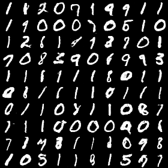
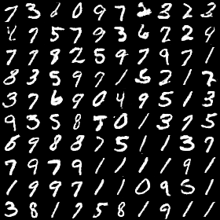
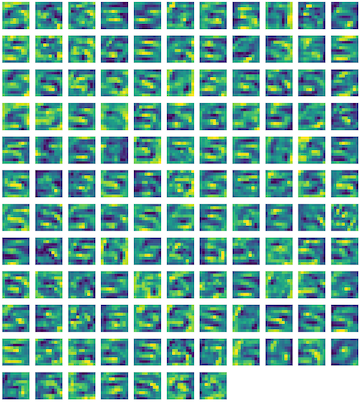
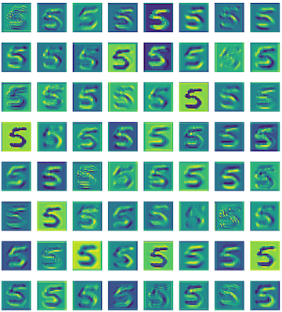
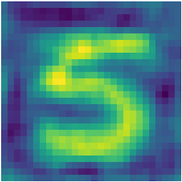
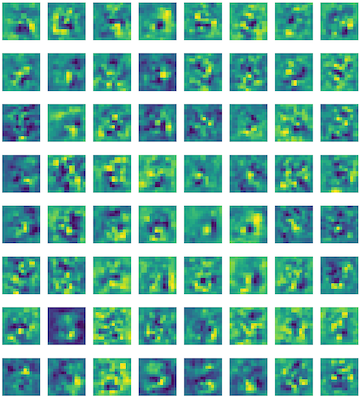

<!-- HEADER -->


<p align="center">
  <h1 align="center">DCGAN-Keract</h1>
  <p align="center">
     Final project for Northwestern University MSDS 458 - Artificial Intelligence and Deep Learning
  </p>
</p>

[](https://github.com/psf/black)

*Please note this project has been forked from https://github.com/jacobgil/keras-dcgan and modified to fit my needs.*


---
## Table of Contents
* [Overview](#overview)
* [Usage](#usage)
* [Results](#results)


---
## Overview
Implementation of http://arxiv.org/abs/1511.06434 using [Keras](https://github.com/fchollet/keras), for generating artificial images with deep learning.

This program trains two adversarial deep learning models on real images from the MNIST dataset, in order to produce artificial images that look real. The generator model tries to produce images that look real and get a high score from the discriminator. The discriminator model tries to tell apart between real images and artificial images from the generator.
!(./assets/gan_diagram.png)

The (awesome) [Keract](https://github.com/philipperemy/keract) library is then used to get a closer look at activations for the convolutional filters (in the discriminator) and deconvolutional filters (in the generator).

---
## Usage
You'll need Python 3.7+ and pipenv installed to run this.

**Install dependencies and start venv:**
```sh
$ pipenv shell
$ pipenv install
```


**Training:**
```sh
$ python3 dcgan.py --mode train --batch_size <batch_size>

```


**Image generation:**


```sh
$ python3 dcgan.py --mode generate --batch_size <batch_size>

```
Or to generate top 5% nicest images according to discriminator:
```sh
$ python3 dcgan.py --mode generate --batch_size <batch_size> --nice

```


**Convolution layer visualization:**

```sh
$ python3 dcgan.py --mode activations
```

---


## Results


**Generated images:**








**Training process:**


**Convolution Layer Filters** (from the discriminator network):

*Conv-128*



*Conv-64*




**Deconvolution Layer Filters** (from the generator network):

*Deconv-1*



*Deconv-64*


